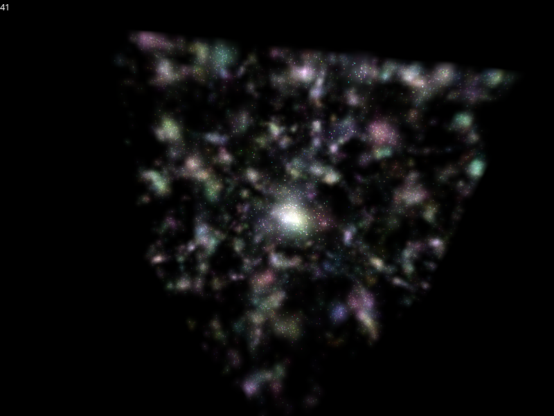

# Particles 3D

This is an optimised n-body gravity simulation with smooth volumetric raymarched lighting and thousands of particles. It uses Newton's laws of motion, has dark energy to resist the collapse of the system and allow structure to last for longer, is consistent on units/dimensions for calculations, etc.

It runs using the LÖVE framework, requires at least LÖVE 12.

Controls:

- Move right: D
- Move left: A
- Move up: E
- Move down: Q
- Move forwards: W
- Move backwards: S
- Pitch down: K
- Pitch up: I
- Yaw right: L
- Yaw left: J
- Roll anticlockwise: U
- Roll clockwise: O

Here is a screenshot of it running on an integrated graphics card. Without linearly filtering the volumetric data, it runs at 60 Hz.

